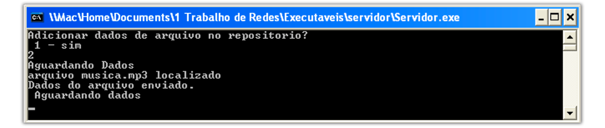
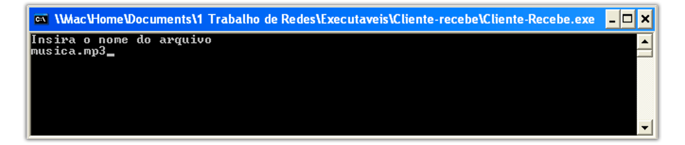
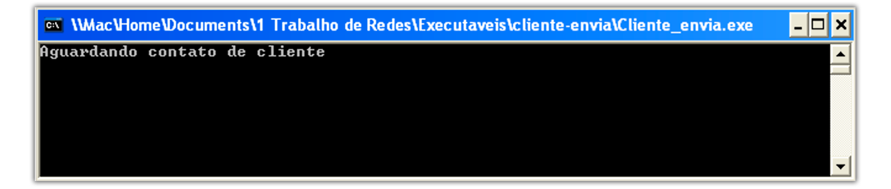

## Versão
1.0.0
## Disponibilizado
Junho - 2018

## Desenvolvido Por
```
André Felipe Magalhães Silva - CCO
	- Email: andrefelipe1@hotmail.com
	
José Luiz Corrêa Junior - CCO
	- Email: juninhopc@icloud.com
	- Snap: juninhopc
```


> Itajubá - MG
>>Universidade Federal de Itajubá - UNIFEI

## O TROLLSFERIDOR UDP® consiste em 3 executáveis
* Cliente-Envia.exe
* CLiente-Recebe.exe
* Servidor.exe

## Uma Breve História do Trollsferidor UDP®

O **Trollsferidor UDP®** consiste em um conjunto de 3 programas escritos em C para permitir a transferência de arquivos entre diferentes hosts, embora na compilação padrão e no exemplo esteja sendo utilizada a mesma máquina.

* Utiliza o protocolo UDP 

* A integridade e a entrega dos pacotes é garantida por meio da soma de verificação (checksum), número de sequência, temporizadores e pacotes de reconhecimento.

*- Por ser destinado para estudo os codigos utilizados também se encontram disponíveis para serem alterados e recompilados como desejado.*

## Organizacao inicial dos arquivos

> #### Trollsferidor_UDP
>>Readme
>>>Readme.md

>>>Readme.html

>>>Readme.pdf

>>>Imagens
>>>>cl_envia.png

>>>>cl_recebe.pngs
>>>>
>>>>exemplo.png
>>>>
>>>>transferencia.png
>>>>
>>>>serv.png
>>>>
>>>>troll.png
>>>>
>>>>configur.png

>>Cliente-Envia
>>>Cliente-Envia.c

>> Cliente-Recebe
>>> Cliente-Recebe.c

>> Servidor
>>> Servidor.c

>> Executáveis
>>>Cliente-Envia
	
>>>>Cliente-Envia.exe

>>>>imagem.jpg

>>>>musica.mp3

>>>>texto.txt

>>>CLiente-Recebe

>>>>Cliente-Recebe.exe

>>>Servidor
>>>>Servidor.exe

>>>>respositorio.bs


## Considerações importantes:


- Os Sistemas Operacional Suportado é o Microsoft Windows

- Os Arquivos a serem enviados devem estar na mesmo diretório que o Cliente-Envia.exe

- IP como `127.0.0.1`, logo, os programas devem ser executados todos na mesma máquina. (por ter fim puramente acadêmico).

- Tamanho do buffer = `1024`

- A porta já está definida como: `10222`

- Porém mudanças podem ser feitas, exigindo recompilação.

- Sinta-se livre para modificar!


## Configuração do Cliente-Recebe.exe

O `Cliente-Recebe` tem como função solicitar a transferência de um arquivo por meio da busca pelo nome do mesmo.
	
* Somente tem como entrada o nome do arquivo desejado.

## Configuração do Cliente-Envia.exe
O `Cliente_Envia.exe` tem como função possuir os arquivos requisitados e os enviar.

*Obs.: Apenas fica em escuta após ter sido iniciado, aguardando conexão.*

* Não recebe nada como entrada.

# Configuração do Servidor.exe

O `Servidor.exe` tem com função rastrear o possuidor dos arquivos desejados.

* Ao iniciado oferece 2 opções:

| Opção  | Função |
|:------------- |:---------------:|
| `1`     | Adicionar dados de arquivo no repositório |         
| `2`      | Continuar sem adicionar novos dados|               


*Obs.: Depois de selecionada uma opção fica em escuta por um cliente que deseja encontrar um arquivo.*

* Somente recebe opção `1` ou `2` como entrada.

***


#### O que será usado nesse exemplo:
* Cliente-Recebe.exe
* Cliente-Envia.exe
* Servidor.exe
* musica.mp3

*Sistema Operacional: Windows XP*


**Passos:**

```1º - Servidor.exe iniciado e escolhida opção "2".```



```2º - Cliente-Recebe.exe iniciado busacado o aquivo "musica.mp3".```



```3º - Cliente-Envia.exe somente deixado em execução.```



```4º - Caso o arquivo buscado exista a transferência já terá iniciado.```


```5º - Transferência concluida!```


---

